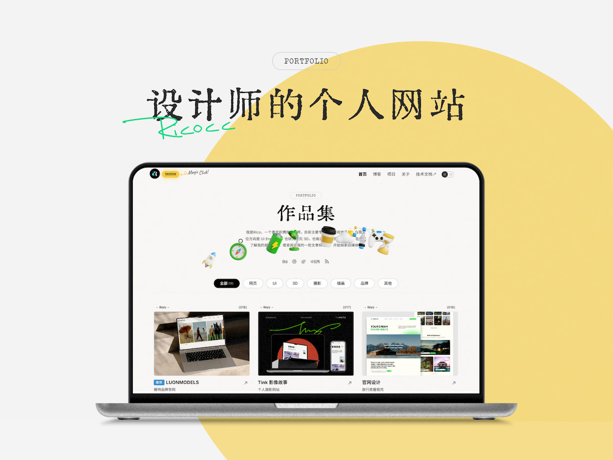

# 观世界 · 产品摄影作品集

<a href="./README_EN.md" style="margin-bottom:16px">ENGLISH README</a>

基于 Astro 的摄影师个人站，定位为**产品展厅气质的获客站点**：首屏品牌 + 预约 CTA，作品网格展示摄影与视频，适合产品静物、空间场景与影像短片。

## 网站预览

- 线上地址：以你的 `PUBLIC_SITE_URL` 为准
- 仓库：本仓库



## 技术栈

- Astro `6.4.4`
- `@astrojs/mdx`
- `@astrojs/sitemap`
- `@astrojs/rss`
- Sass
- TypeScript
- Sharp，用于 Astro 图片优化
- pnpm

## 近期改版（2026-07 · 产品展厅获客）

- **首页漏斗**：Hero（品牌「观世界」）→ 服务类型 → 精选作品 → 合作流程 → 联系预约
- **视觉 token**：冷中性浅底、墨色 CTA、克制圆角；暗色主题去掉紫色渐变
- **作品网格**：支持 `ratio` 灵活比例、去卡片化；筛选文案改为「精选 / 静物与空间 / 影像」
- **获客**：微信弹层（`Wechat.astro`）+ 邮件 CTA；导航收敛为 首页 / 作品 / 关于（博客在页脚）
- **内容清理**：移除设计师模板示例详情页与 3D 示例卡片

### 视觉与字体

| 用途 | 选择 |
|---|---|
| 品牌 / 大标题 | 汇文明朝（`font-huiwen` / `--font-display`） |
| 正文 | Noto Sans SC |
| 背景 | `--gallery-atmosphere` 径向+线性浅灰氛围，避免纯平色 |
| CTA | 墨色实心 / 线框次按钮（`CallToAction.astro`） |

## 启动项目

```bash
pnpm install
pnpm dev
```

常用命令：

| 命令 | 说明 |
| :-- | :-- |
| `pnpm dev` | 启动本地开发服务，默认地址通常是 `localhost:4321` |
| `pnpm build` | 执行 `astro check` 并构建静态站点到 `dist/` |
| `pnpm preview` | 本地预览生产构建结果 |
| `pnpm astro check` | 运行 Astro 诊断与类型检查 |

## 环境变量

复制 `.env.example` 为 `.env`，然后按需填写：

```bash
PUBLIC_SITE_URL=https://example.com/
PUBLIC_SITE_NAME="观世界"
PUBLIC_GA4_ID=
PUBLIC_UMAMI_ID=
```

- `PUBLIC_SITE_URL`：**必填**。网站公开地址，用于 sitemap、RSS 和 SEO 信息。未设置时构建会失败。
- `PUBLIC_SITE_NAME`：网站名称。
- `PUBLIC_GA4_ID`：可选，Google Analytics 4 ID。
- `PUBLIC_UMAMI_ID`：可选，Umami Website ID。

## 首页分区与组件

| 分区 | 组件 | 说明 |
|---|---|---|
| 首屏 | `src/components/home/HeroShowcase.astro` | 全幅背景图 + 品牌名 + 一句定位 +「预约拍摄 / 浏览作品」 |
| 服务 | `src/components/home/Services.astro` | 产品静物 / 空间场景 / 影像短片 |
| 作品 | `Cards.astro` + `#works` | 筛选 + 灵活比例网格 + lightbox / B 站播放 |
| 流程 | `src/components/home/Process.astro` | 沟通 → 拍摄 → 交付 |
| 联系 | `src/components/home/ContactBand.astro` | 微信预约 + 邮件 |

微信弹层：`src/components/Wechat.astro`（已挂到 `BaseLayout` / `BlogPostLayout`）。

- 任意元素加 class `wechat` 即可打开弹层
- 将二维码放到 `public/assets/wechat-qr.jpg`（也支持 `.png` / `.webp`）；构建时若文件不存在则**不请求图片**，弹层直接提示改用邮件 / B 站

> **首页卡片 `category`**：支持逗号分隔多分类（如 `photography,recommend`），组件会拆成 JSON 数组供 Shuffle 筛选使用。

## 内容与数据

主要内容配置集中在 `src/data/`：

- `src/data/content.ts`：站点基础信息、导航、SEO 文案、社交链接、筛选项、页头文案等。
- `src/data/home.json`：首页作品卡片数据。
- `src/data/project.ts`：`/project` 作品系列列表。

首页作品数据示例：

```json
{
  "id": "1",
  "cover": "https://example.com/cover.jpg",
  "title": "厨房",
  "desc": "家装案例 — 厨房空间",
  "category": "photography,recommend",
  "tag": "空间",
  "date": "2024-07-05",
  "mark": true,
  "ratio": "3/4",
  "images": [
    "https://example.com/01.jpg",
    "https://example.com/02.jpg"
  ]
}
```

字段说明：

- `cover`：封面图路径或外部 URL；外链防盗链场景已设置 `referrerpolicy="no-referrer"`。
- `title` / `desc`：标题与描述。
- `url`：外链（可选）。
- `detail`：详情或外链（可选）。
- `category`：筛选分类，逗号分隔。对应筛选项：`recommend`（精选）、`photography`（静物与空间）、`video`（影像）。
- `tag`：作品类型小标签。
- `date`：日期。
- `mark`：是否显示「精选」标记。
- `ratio`：封面 CSS `aspect-ratio`，如 `3/4`、`16/9`、`1/1`；未填时摄影默认 `3/4`，有 `video` 时默认 `16/9`。
- `hiRes`：高清大图；点击封面时在弹层加载。
- `images`：组图数组；多于一张时可左右切换（键盘 `←` / `→`）。
- `video`：B 站等嵌入播放器地址；封面显示细线播放示意。

视频卡片示例：

```json
{
  "id": "video-1",
  "cover": "https://example.com/cover.jpg",
  "title": "作品标题",
  "desc": "",
  "category": "video,recommend",
  "tag": "影像",
  "date": "2026-06-24",
  "mark": true,
  "ratio": "16/9",
  "video": "https://player.bilibili.com/player.html?bvid=BVxxxxxxxx"
}
```

摄影、视频作品若需出现在「精选」筛选中，在 `category` 中追加 `recommend`，并设置 `mark: true`。带 `video` 字段的卡片点击封面会弹出全屏播放层。

**控制台报错说明：** 嵌入 B 站播放器时，若浏览器安装了广告拦截插件，可能出现 `ERR_BLOCKED_BY_CLIENT` 等报错——通常不影响播放。可点击「在 B 站打开」。

## 博客内容

- 内容配置：`src/content.config.ts`
- 博客目录：`src/content/blog/`
- 支持格式：`*.md` 和 `*.mdx`

博客入口在页脚「博客」，不占用主导航。正文图片支持 `BlogImageZoom` / `BlogImageGallery`。

## 作品系列页

`/project` 读取 `src/data/project.ts`。封面可为本地路径（`src/assets/projects/`）或完整 URL。`detail` / `url` 可指向首页 `#works`、外链或日后自建案例页。

如需站内案例详情，可在 `src/pages/detail/` 下新建 `.astro` 页面。

## 字体

- 品牌 / 大标题：汇文明朝
- 中文正文：Noto Sans SC
- 英文点缀（可选）：Special Elite

## 项目结构

```text
/
├─ public/
│  ├─ assets/
│  │  ├─ cover/
│  │  └─ wechat-qr.jpg   # 可选，微信二维码
│  ├─ plugins/
│  └─ favicon.png
├─ src/
│  ├─ assets/
│  ├─ components/
│  │  └─ home/           # Hero / Services / Process / ContactBand
│  ├─ content/
│  │  └─ blog/
│  ├─ data/
│  ├─ layouts/
│  ├─ pages/
│  ├─ styles/
│  └─ content.config.ts
├─ astro.config.mjs
├─ package.json
└─ pnpm-lock.yaml
```

## 部署

```bash
pnpm build
```

构建产物位于 `dist/`，推荐 Cloudflare Workers（静态资源）或 Pages。`wrangler.jsonc` 已声明 `assets.directory: "./dist"`。

```bash
pnpm exec wrangler login
cp .env.example .env
pnpm deploy
```

必填环境变量：`PUBLIC_SITE_URL`。

### Cloudflare 构建变量（重要）

Git 连接自动部署时，CI **读不到** 本地 `.env`。请在 Cloudflare Dashboard 配置：

1. 打开项目 → **Settings** → **Variables and Secrets**（或 Build → Environment variables）
2. 为 **Production** 与 **Preview** 添加：

| 变量名 | 示例值 |
|--------|--------|
| `PUBLIC_SITE_URL` | `https://public-portfolio-site.pages.dev`（或你的自定义域名） |
| `PUBLIC_SITE_NAME` | `观世界` |

未配置时，构建会回退到 `https://public-portfolio-site.pages.dev`，并在日志中打印警告。

## License

[MIT](./LICENSE)
