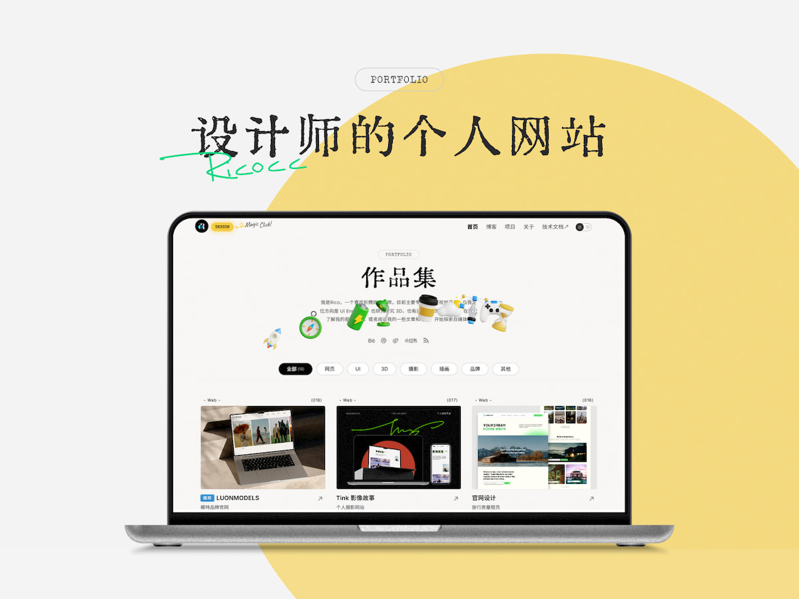

# Designer Portfolio Site

[中文说明](./README.md)

An Astro-based portfolio and blog template for designers, makers, independent developers, and personal brand websites.

- Live site: [ricoui.com](https://ricoui.com/)
- Repository: [github.com/ricocc/public-portfolio-site](https://github.com/ricocc/public-portfolio-site)



## Tech Stack

- Astro `6.4.4`
- `@astrojs/mdx`
- `@astrojs/sitemap`
- `@astrojs/rss`
- Sass
- TypeScript
- Sharp for Astro image optimization
- pnpm

## Getting Started

```bash
pnpm install
pnpm dev
```

Common commands:

| Command | Action |
| :-- | :-- |
| `pnpm dev` | Start the local dev server, usually at `localhost:4321` |
| `pnpm build` | Run `astro check` and build the static site into `dist/` |
| `pnpm preview` | Preview the production build locally |
| `pnpm astro check` | Run Astro diagnostics and type checks |

## Environment Variables

Copy `.env.example` to `.env` and configure values as needed:

```bash
PUBLIC_SITE_URL=https://example.com/
PUBLIC_SITE_NAME="Your Site Name"
PUBLIC_GA4_ID=
PUBLIC_UMAMI_ID=
```

- `PUBLIC_SITE_URL`: Public site URL, used by sitemap, RSS, and SEO metadata.
- `PUBLIC_SITE_NAME`: Site name.
- `PUBLIC_GA4_ID`: Optional Google Analytics 4 ID.
- `PUBLIC_UMAMI_ID`: Optional Umami website ID.

Leave `PUBLIC_GA4_ID` and `PUBLIC_UMAMI_ID` empty if you do not need analytics.

## Content And Data

Main data files live in `src/data/`:

- `src/data/content.ts`: Site metadata, navigation, SEO text, social links, and page copy.
- `src/data/home.json`: Homepage portfolio cards.
- `src/data/project.ts`: Project-list data.

Homepage card example:

```json
{
  "id": "10",
  "cover": "/assets/cover/cover-ricoui-starter.jpg",
  "useVideo": false,
  "title": "RicoUI Astro 启动模板",
  "desc": "Ricoui Starter Template",
  "url": "https://ricoui-saas-zh.netlify.app/",
  "detail": "https://ricoui-saas-zh.netlify.app/",
  "category": "web,recommend",
  "tag": "Web",
  "date": "2026-06-07",
  "mark": true,
  "opensource": false
}
```

Field notes:

- `cover`: Cover image path. Homepage covers currently live in `public/assets/cover/`.
- `useVideo`: Whether to use a video cover.
- `title`: Project title.
- `desc`: Project description.
- `url`: Live URL.
- `detail`: Detail page path or external detail URL.
- `category`: Filter categories. Use comma-separated values for multiple categories, such as `web,recommend`.
- `tag`: Card tag.
- `date`: Date used for display and sorting.
- `mark`: Whether to show the recommendation badge.
- `opensource`: Whether to show open-source related status.

## Blog Content

Blog posts use the Astro 6 Content Layer API.

- Content config: `src/content.config.ts`
- Blog directory: `src/content/blog/`
- Supported formats: `*.md` and `*.mdx`

Example frontmatter:

```yaml
---
title: Article title
description: Article description
publishDate: 2026-06-07
read: 5
tags:
  - Astro
img: /preview-01.jpg
img_alt: Preview image
---
```

The old `src/content/config.ts` has been migrated to `src/content.config.ts`, and the collection uses the `glob()` loader from `astro/loaders`.

Inline blog images are capped at `70vh` so tall screenshots do not dominate the page. Click any image to open a fullscreen viewer with mouse-wheel zoom, pinch-to-zoom, drag-to-pan, toolbar controls (+/−/reset), and `Esc` or backdrop click to close. Component: `src/components/BlogImageZoom.astro`.

## Project Detail Pages

Project detail pages live in:

```text
src/pages/detail/
```

If a portfolio card uses an internal `detail` path, such as `/detail/todo`, create the matching `.astro` page under `src/pages/detail/`. Local image galleries now use `import.meta.glob()` and Astro's `<Image />` component.

## GitHub Stars

The GitHub star badge is hidden from the navigation by default. The component remains at `src/components/GitHubStars.astro`; re-import it in `Nav.astro` and `NavMobile.astro` to show it again.

On page load, it requests the GitHub public API:

```text
https://api.github.com/repos/ricocc/public-portfolio-site
```

The UI is updated with the repository's real `stargazers_count`. Unauthenticated GitHub API requests are rate-limited; for high-traffic deployments, use a cached server endpoint.

## Fonts

- Chinese body font: Noto Sans SC
- English fonts: Special Elite / Inter / Inconsolata
- Some Chinese headings are embedded as SVG to keep the runtime font payload smaller.

## Project Structure

```text
/
├─ public/
│  ├─ assets/
│  │  └─ cover/
│  ├─ plugins/
│  └─ favicon.png
├─ src/
│  ├─ assets/
│  ├─ components/
│  ├─ content/
│  │  └─ blog/
│  ├─ data/
│  ├─ effects/
│  ├─ layouts/
│  ├─ pages/
│  ├─ styles/
│  └─ content.config.ts
├─ astro.config.mjs
├─ package.json
└─ pnpm-lock.yaml
```

## Deployment

The project builds to a static site:

```bash
pnpm build
```

The generated output is in `dist/` and can be deployed to Netlify, Vercel, Cloudflare Pages, GitHub Pages, or any static hosting service.

### Cloudflare Pages

This project is a static Astro site and works well on **Cloudflare Workers (static assets)** or **Cloudflare Pages**.

#### Option 1: Connect Git (recommended)

1. Open [Cloudflare Dashboard](https://dash.cloudflare.com/) → **Workers & Pages** → **Create** → connect the `Chacat68/public-portfolio-site` repository
2. Build settings:

| Setting | Value |
|---------|-------|
| Framework preset | Astro |
| Build command | `pnpm run build` |
| Build output directory | `dist` |
| Deploy command | `npx wrangler deploy` |
| Node.js version | `22` (or use `.node-version`) |

> **Note:** `wrangler.jsonc` declares `assets.directory: "./dist"`, so Wrangler treats this as a static site and will **not** auto-install the `@astrojs/cloudflare` adapter.

3. Add environment variables for Production and Preview:

| Variable | Description |
|----------|-------------|
| `PUBLIC_SITE_URL` | Production URL, e.g. `https://your-domain.pages.dev` |
| `PUBLIC_SITE_NAME` | Site name |
| `PUBLIC_GA4_ID` | (optional) Google Analytics 4 ID |
| `PUBLIC_UMAMI_ID` | (optional) Umami analytics ID |

4. Save. Cloudflare will build and deploy on every push to `main`.

#### Option 2: Deploy with Wrangler CLI

```bash
pnpm exec wrangler login
cp .env.example .env
pnpm deploy
```

After deployment, bind a custom domain in the Cloudflare Dashboard.

## Changelog

- 2026-06-07: Upgraded to Astro 6, migrated to the Content Layer API, and replaced old `Astro.glob()` usage.
- 2026-06-07: Switched to pnpm and added `sharp` for Astro image optimization.
- 2026-06-07: Updated homepage portfolio data and cover assets, and removed old `inspoweb` / `cover-travel` entries.
- 2026-06-07: Added GitHub icon and live star count to desktop and mobile navigation.

## About

Rico is a web and UI designer focused on visual design and independent product development. More notes are published on [Rico's Blog](https://blog.ricocc.com/). You can also find Rico on [Xiaohongshu](https://www.xiaohongshu.com/user/profile/5f2b6903000000000101f51f) and [X](https://x.com/ricouii).

## Other Templates

- **SaaS Template**: [https://github.com/ricocc/ricoui-saas-template](https://github.com/ricocc/ricoui-saas-template)
- **Portfolio Template**: [https://github.com/ricocc/ricoui-portfolio](https://github.com/ricocc/ricoui-portfolio)
- **Blog Template**: [https://github.com/ricocc/public-portfolio-site](https://github.com/ricocc/public-portfolio-site)

## Support

If this template helps you, a small contribution is always appreciated.


## License

[MIT](./LICENSE)
